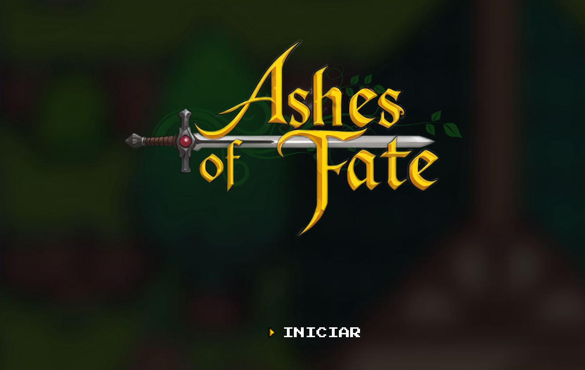
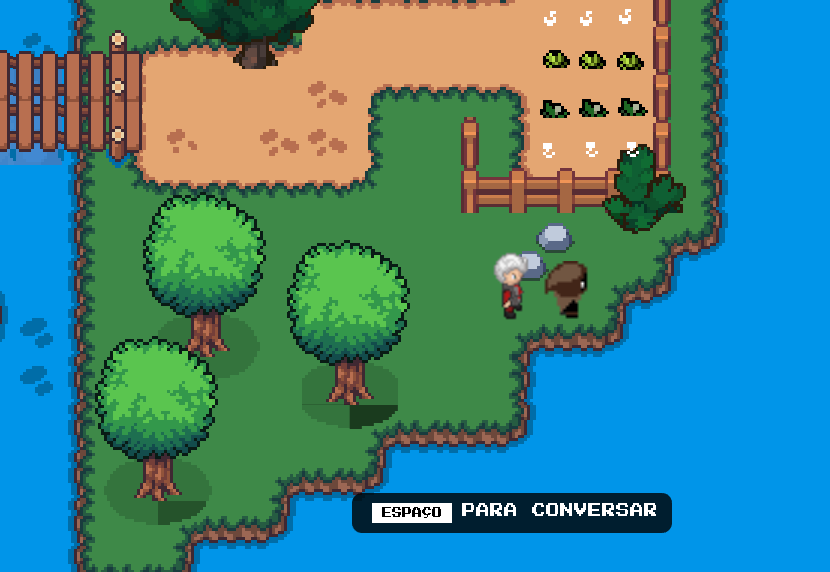
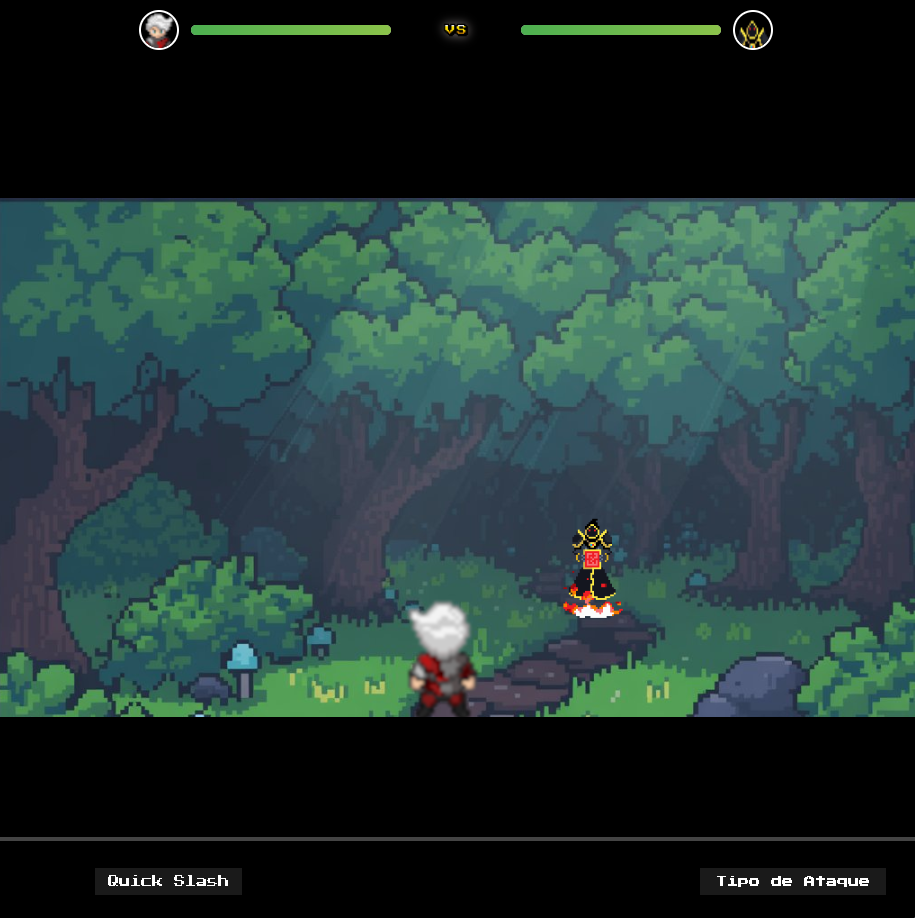

<h1 align="center" style="font-weight: bold;">Ashes Of Fate 💻</h1>

<p align="center">
 <a href="#tech">Tecnologias</a> • 
 <a href="#started">Início</a> • 
  <a href="#colab">Colaboradores</a> •
 <a href="#contribute">Contribuição</a>
</p>

<p align="center">
    <b>Ashes of Fate é um jogo RPG top-down desenvolvido em JavaScript, HTML e CSS, inspirado em clássicos do gênero como The Legend of Zelda. A história se desenrola em um mundo de fantasia sombria e trágica, onde o protagonista, Zarien Thorne, busca os lendários Cinco Artefatos de Terra Desconhecida para ressuscitar sua esposa, perdida para uma doença misteriosa.</b>
</p>

## Características do Jogo
- **Mecânica de Exploração**: Navegue pelas Ilhas de Orlath, resolvendo enigmas e desvendando segredos.
- **Sistema de Colisão**: Implementado via JavaScript para limitar o movimento do personagem em barreiras do mapa.
- **Sprites Animados**: Movimentação fluida do personagem com animações para caminhar, atacar e estados de inatividade.
- **Interação com Objetos**: Resolva desafios para desbloquear caminhos e coletar itens essenciais.


## Como Jogar
1. **Movimentação**: Use as teclas **WASD** para deslocar Zarien pelo mapa.
2. **Interagir**: Aproxime-se de objetos e NPCs para ativar interações.
3. **Resolver Puzzles**: Encontre soluções para enigmas que bloqueiam seu progresso.
4. **Colete os Artefatos**: Percorra as ilhas e descubra os Cinco Artefatos de Terra Desconhecida.
5. **Descubra a Verdade**: Ao interagir com elementos descobre mais detalhes da história


<p align="center">
     <a href="https://ashesoffate.netlify.app/">Visite o Projeto</a>
</p>

<h2 id="layout">🎨 Layout</h2>

<p align="center">
    
    
    
    
    
    
</p>

<h2 id="tech">💻 Tecnologias</h2>

- HTML5
- CSS3
- JavaScript
- Tiled
- Piskel
- Netlify

<h2 id="started">🚀 Início</h2>

1. Clone este repositório:
   ```bash
   git clone https://github.com/seu-usuario/ashes-of-fate.git
   ```
2. Navegue até a pasta do projeto:
   ```bash
   cd ashes-of-fate
   ```
3. Abra o arquivo `index.html` em seu navegador.


<h3>Pré-requisito</h3>

- [Visual Studio Code](https://code.visualstudio.com/docs/setup/windows)
- [Git Bash](https://git-scm.com/downloads)

<h3>Comece a jogar!</h3>


[Ashes Of Fate](https://ashesoffate.netlify.app/)

<h2 id="colab">🤝 Colaboradores</h2>

Um agradecimento especial a todas as pessoas que contribuíram para este projeto.

<table>
  <tr>
    <td align="center">
      <a href="https://github.com/DanielSUTD">
        <br>
        <sub>
          <b>DanielSUTD</b>
        </sub>
      </a>
    </td>
    <td align="center">
      <a href="https://github.com/carlalopesj">
        <br>
        <sub>
          <b>Carla Lopes</b>
        </sub>
      </a>
    </td>
  </tr>
</table>


---

<h2 id="contribute">📫 Contribuição</h2>

Quer contribuir com este projeto? Siga estes passos simples para ajudar a melhorá-lo:

1. **Clone o repositório**

```bash
git clone https://github.com/seu-usuario/ashes-of-fate.git
```

2. **Crie uma nova branch para sua feature ou correção**

```bash
git checkout -b feature/NOME
```

3. **Siga o padrão de commits**

* Use mensagens claras e objetivas.
* Mencione o problema ou feature que seu commit resolve.
* Exemplo: `feat: add search functionality` ou `fix: resolve crash on load`.

4. **Abra um Pull Request (PR)**

* Descreva o problema resolvido ou a feature adicionada.
* Se houver alterações visuais, adicione screenshots.
* Aguarde a revisão e feedback antes de mesclar.

<h3>📚 Documentações úteis</h3>

* [Pull Request](https://www.atlassian.com/br/git/tutorials/making-a-pull-request)
* [Commit Patterns](https://github.com/iuricode/padroes-de-commits)

---
